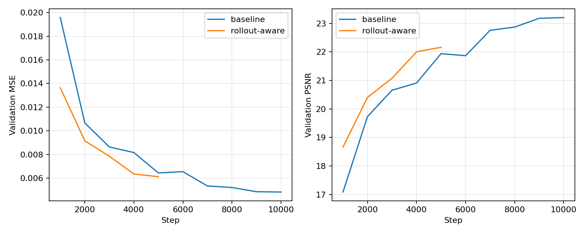
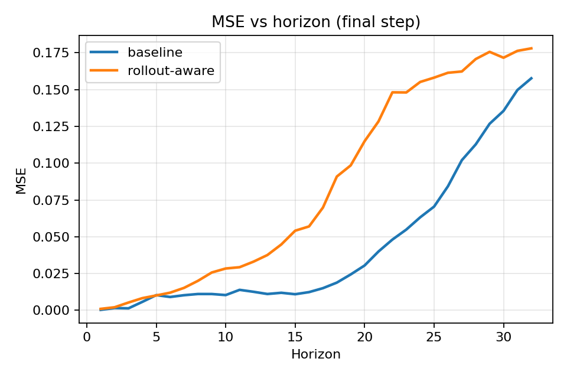
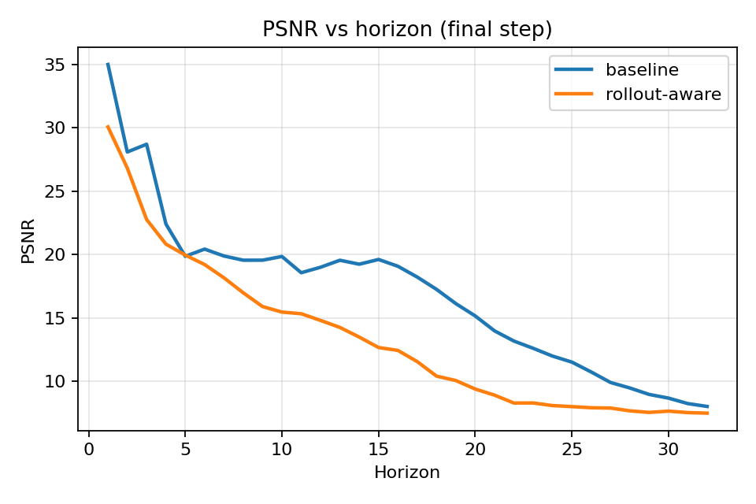
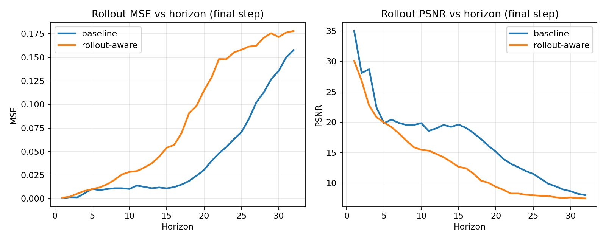
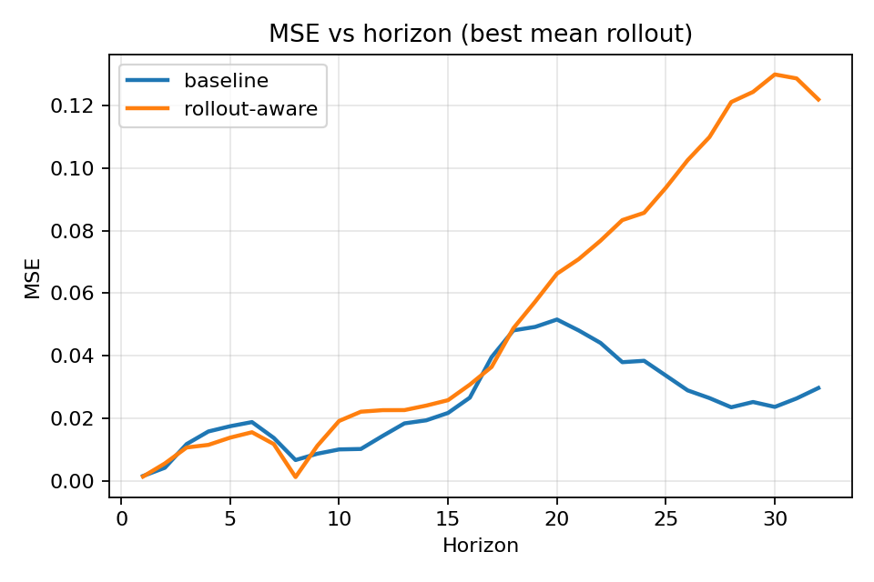
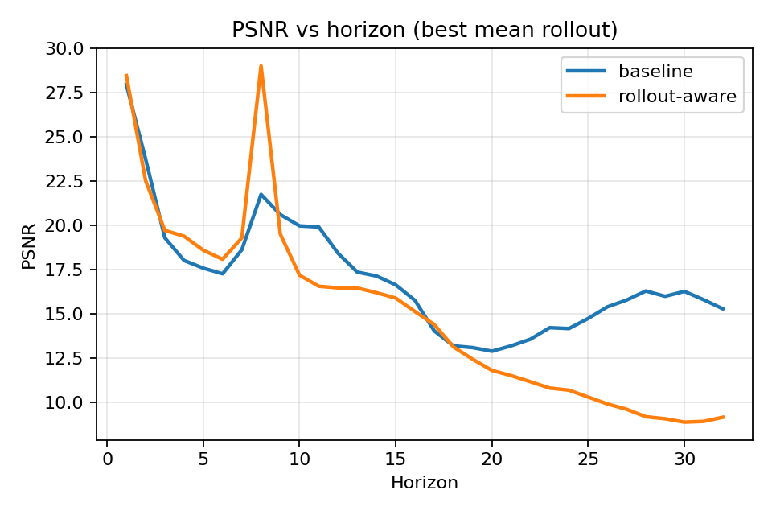
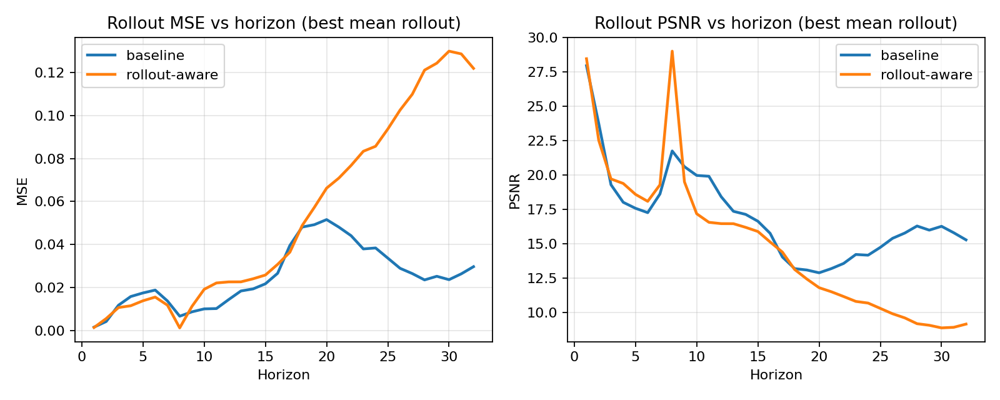

# Rollout-aware training experiment report

- Baseline: `runs/20260222_195539_coinrun`
- Candidate: `runs/20260320_rollout_aware_ss`
- Branch: `exp/rollout-aware-scheduled-sampling`

## What changed in the candidate supervision

The baseline run uses only the original **latent flow-matching loss**:
- inputs: past RGB frame stack + past actions + future action sequence
- target: future RGB frames, supervised indirectly through latent flow matching
- training context is teacher-forced from ground-truth observations

The candidate adds a second supervision path on top of that baseline objective.

### New rollout-aware auxiliary loss
For each minibatch, the candidate additionally:
1. rolls the model forward autoregressively for up to 4 steps,
2. at each step predicts the next frame using the current context,
3. compares the **first predicted frame** to the corresponding ground-truth frame using decoded-frame **MSE**,
4. averages those per-step losses and adds them to the base loss with weight `0.25`.

### Scheduled sampling change
Instead of always feeding the next ground-truth frame back into context, the candidate sometimes feeds back the model prediction.

Schedule used in this run:
- `start_step = 1000`
- `ramp_steps = 4000`
- `max_prob = 0.5`
- rollout context length for auxiliary loss = `4` steps
- auxiliary rollout sampling steps = `4`

Interpretation:
- before step 1000: pure teacher forcing for the auxiliary path
- after that: the probability of using the model-generated frame in the context gradually rises up to 50%

## Final validation metrics

| Metric | Baseline | Candidate |
|---|---:|---:|
| val_loss | 0.160543 | 0.190980 |
| val_mse | 0.004818 | 0.006118 |
| val_psnr | 23.203 | 22.160 |
| val_ssim | 0.8805 | 0.8602 |

## Candidate-only validation summary

| Checkpoint step | val_loss | val_mse | val_psnr | val_ssim |
|---:|---:|---:|---:|---:|
| 1000 | 0.421320 | 0.013642 | 18.660 | 0.6738 |
| 2000 | 0.263393 | 0.009148 | 20.404 | 0.8104 |
| 3000 | 0.216598 | 0.007849 | 21.074 | 0.8397 |
| 4000 | 0.200079 | 0.006342 | 22.001 | 0.8560 |
| 5000 | 0.190980 | 0.006118 | 22.160 | 0.8602 |

Candidate trend:
- training stayed stable throughout,
- validation metrics improved monotonically across logged checkpoints,
- but the final candidate still underperformed the stronger baseline on all reported validation metrics.

## Final rollout metrics by selected horizons

| Horizon | Baseline MSE | Candidate MSE | Baseline PSNR | Candidate PSNR |
|---:|---:|---:|---:|---:|
| 1 | 0.000317 | 0.000986 | 34.983 | 30.060 |
| 5 | 0.010332 | 0.010105 | 19.858 | 19.955 |
| 10 | 0.010365 | 0.028426 | 19.844 | 15.463 |
| 20 | 0.030487 | 0.114955 | 15.159 | 9.395 |
| 32 | 0.157678 | 0.178039 | 8.022 | 7.495 |

## Comparison summary

### Where the candidate helped
- At **horizon 5**, the candidate was essentially tied with the baseline and slightly better in both MSE and PSNR.
- The candidate also showed strong early-learning behavior: at low training steps it had reasonable validation quality quickly.

### Where the candidate hurt
- At **horizon 1**, the candidate was worse than baseline.
- From **horizon 10 onward**, the candidate clearly underperformed.
- The largest gap was in the medium-to-long rollout regime:
  - H10 MSE: `0.028426` vs baseline `0.010365`
  - H20 MSE: `0.114955` vs baseline `0.030487`
  - H32 MSE: `0.178039` vs baseline `0.157678`

### Likely reason
This particular supervision change appears to have introduced more exposure to off-manifold predicted frames than the model could exploit effectively.

The added decoded-frame MSE objective likely did two things at once:
- encouraged short-term frame matching,
- but pushed training into contexts that were noisier than the latent dynamics model could robustly recover from.

In other words, the candidate got a more rollout-like training signal, but the exact formulation here was not strong or aligned enough to improve long-horizon open-loop behavior.

## Bottom line

This candidate should be considered **negative / informative** rather than successful.

Verdict:
- **Do not replace the baseline with this exact rollout-aware scheduled-sampling setup.**
- Keep it as evidence that naive decoded-frame scheduled sampling is not sufficient here.

## Recommended next follow-ups

1. Use a **later and shallower** scheduled-sampling ramp.
2. Lower the rollout auxiliary loss weight below `0.25`.
3. Move the auxiliary supervision into **latent space** rather than decoded RGB frame MSE.
4. Try a stronger temporal backbone before further increasing rollout supervision strength.

## Embedded plots

### Validation curves

### Final checkpoint: MSE vs horizon

### Final checkpoint: PSNR vs horizon

### Final checkpoint: combined rollout curves

### Best mean-rollout checkpoint: MSE vs horizon

### Best mean-rollout checkpoint: PSNR vs horizon

### Best mean-rollout checkpoint: combined rollout curves

